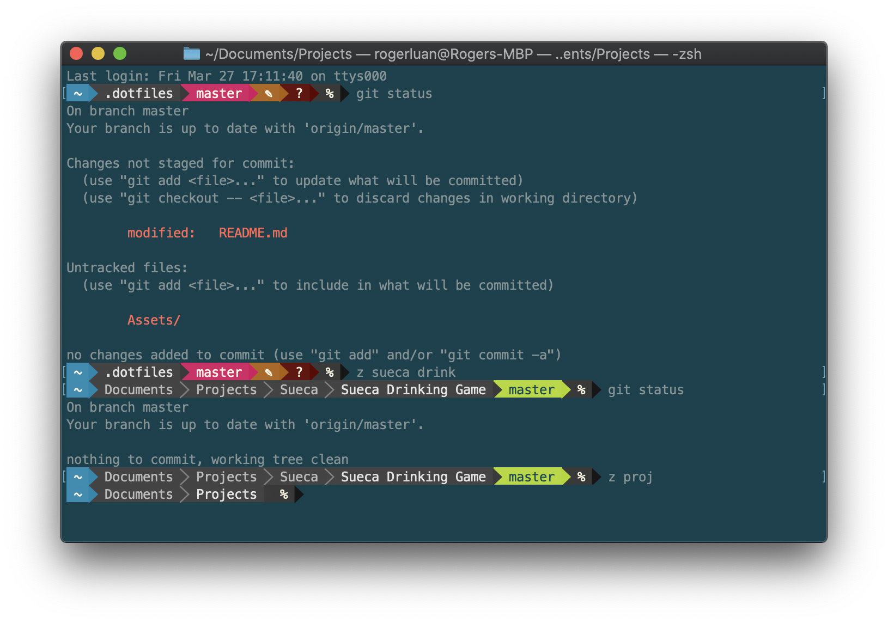

# Roger's dotfiles

A bundle of all my dotfiles as well as a handful of scripts to help set up macOS from scratch.

Before doing anything, make sure you know what are you doing! Settings applied by this repository are very personal, and definitely don't suite everyone's needs. I suggest you to create your own set of dotfiles based on this repo.

## Installation Steps

1. Set up SSH keys

```sh
bash <(curl -s https://raw.githubusercontent.com/rogerluan/dotfiles/master/set_up_ssh_key.sh)
```

2. Clone this repo into ~/.dotfiles

```sh
git clone git@github.com:rogerluan/dotfiles.git ~/.dotfiles
cd ~/.dotfiles
./_set_up.sh
```

## What Terminal is Roger using



Since every time I post a screenshot of my Terminal I get asked what Terminal I use, here's some information about how I set up my Terminal, and the reasons:

- I use the stock Terminal app, because I see no benefit using 3rd party Terminals (yet? Let me know if you know think otherwise!)
- I use [oh-my-zshell](https://github.com/robbyrussell/oh-my-zsh), because of its amazing plugins.
- I use [rbenv](https://github.com/rbenv/rbenv) instead of [rvm](https://rvm.io/), because it's easier to manage and more lightweight.
- I use a customized version of [Solarized Dark](http://ethanschoonover.com/solarized) for the Terminal colors (as well as all code-related themes in my Mac), because it's delightful to look at and it's proven healthier than other palettes (jk, but I totally recommend it :)). The version I use is in this repo under [Solarized Dark.terminal](/Terminal/Solarized%20Dark.terminal)
- I use [powerline-shell](https://github.com/milkbikis/powerline-shell) to get those cool path bars. I hide the host name and the user.
- I use [Meslo Powerline Font](https://github.com/powerline/fonts/blob/master/Meslo%20Slashed/Meslo%20LG%20M%20Regular%20for%20Powerline.ttf) as you need a font that supports the directory characters for `powerline-shell`.
- I use [z](https://github.com/rupa/z), an amazing tool to quickly jump between projects. It's like [Alfred](https://www.alfredapp.com/) but for your Terminal, reduced to folder search only.
- Terminal Preferences → Profiles → Keyboard → "Use `Option` as Meta key", to allow deleting entire words using `Option + Delete` (thanks to [@bruno_hcr](https://twitter.com/bruno_hcr)!)
- For other configurations check out [set_up_terminal.sh](/Terminal/set_up_terminal.sh)

## Apps

I still install all these apps in the old fashioned way: via App Store, or via
the original website, to avoid installing other potentially malicious 3rd party
dependencies that could manage their installation.

### Direct Download

- ExpressVPN https://www.expressvpn.com/setup
- Figma https://www.figma.com/download/desktop/mac
- Firefox https://www.mozilla.org/en-US/firefox/new/
- GPG Suite https://gpgtools.org
- Insomnia https://insomnia.rest
- LSUnusedResources https://github.com/tinymind/LSUnusedResources
- MiddleClick https://github.com/artginzburg/MiddleClick-BigSur
- Popcorn Time https://popcorntime.sh
- Proxyman https://proxyman.io
- RescueTime https://www.rescuetime.com/get_rescuetime
- SF Symbols https://developer.apple.com/sf-symbols/
- SizeUp http://www.irradiatedsoftware.com/sizeup/
- SourceTree https://www.sourcetreeapp.com
- Spotify https://www.spotify.com/br/download/mac/
- TinyPNG4Mac https://github.com/kyleduo/TinyPNG4Mac
- Visual Studio Code https://code.visualstudio.com/download
- VLC https://www.videolan.org/vlc/
- WhatsApp https://www.whatsapp.com/download/
- Xcode - Install all the version needed via [`xcodes`](https://github.com/RobotsAndPencils/xcodes)
- Zoom https://zoom.us/client/latest/zoomusInstallerFull.pkg?archType=arm64

### App Store

- AdBlock
- AdBlock Plus
- Bitwarden
- Git Streak
- Keynote
- NewFileMenuFree
- Numbers
- Pages
- RAR Extractor Lite
- Slack
- SortingMatters
- Telegram
- Toggl
- Trello

### Dock Pinned Applications

- Finder
- Safari
- Xcode
- Slack
- Telegram
- SourceTree
- Visual Studio Code
- Toggl
- Spotify
- Terminal

## Special thanks to…

What dotfiles is Felix using - https://github.com/KrauseFx/dotfiles - via [@KrauseFx](https://twitter.com/krausefx)

What Terminal is Felix using - https://github.com/KrauseFx/what-terminal-is-felix-using - via [@KrauseFx](https://twitter.com/krausefx)

Change macOS User Preferences via Command Line - https://pawelgrzybek.com/change-macos-user-preferences-via-command-line/ - via [@pawelgrzybek](https://twitter.com/pawelgrzybek)

Mathias’s dotfiles - https://github.com/mathiasbynens/dotfiles - via [@mathias](https://twitter.com/mathias)

Moving to zsh, part 2: Configuration Files - https://scriptingosx.com/2019/06/moving-to-zsh-part-2-configuration-files/ - via [@scriptingosx](https://twitter.com/scriptingosx)
